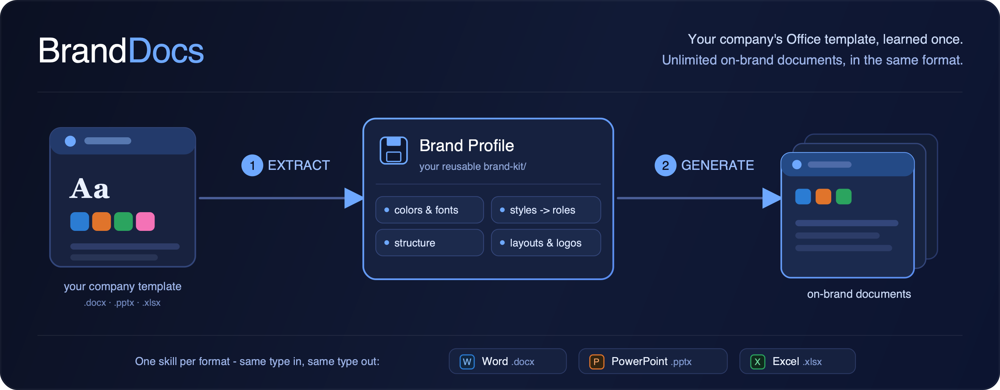

<div align="center">



<br/>

# BrandDocs — AI On-Brand Document Generator for Word, PowerPoint & Excel

**Turn your company's Word, PowerPoint or Excel template into unlimited on-brand documents.** A [Claude Code](https://www.anthropic.com/claude-code) & Codex skill that extracts a reusable **Brand Profile** once and generates faithful **`.docx`, `.pptx` and `.xlsx`** forever — off-brand output impossible by construction.

[](LICENSE)
[](https://www.python.org/)
[](https://github.com/ferdinandobons/brand-docs/actions/workflows/ci.yml)
[](https://ferdinandobons.github.io/brand-docs/)
[](#the-three-skills)
[](#project-status)

</div>

---

## Contents

- [What is BrandDocs?](#what-is-branddocs)
- [Why not just ask an AI to "use this template"?](#why-not-just-ask-an-ai-to-use-this-template)
- [Highlights](#highlights)
- [How it works](#how-it-works)
- [Full plugin workflow](#full-plugin-workflow)
- [Structure-aware, not just style-aware](#structure-aware-not-just-style-aware)
- [Reliability & repair loop](#reliability--repair-loop)
- [The three skills](#the-three-skills)
- [The Brand Kit](#the-brand-kit)
- [Prerequisites & installation](#prerequisites--installation)
- [Quick start](#quick-start)
- [Website, AI discovery & listings](#website-ai-discovery--listings)
- [Project status](#project-status)
- [Development](#development)
- [FAQ](#faq)
- [License & acknowledgements](#license--acknowledgements)

---

## What is BrandDocs?

**BrandDocs** is an **agent-skill bundle** - for Claude Code, Codex, and compatible AI agents - that turns a company's existing Office template into a **reusable brand memory**, then writes new documents that stay faithful to it.

> **In one sentence:** make Claude (or any compatible agent) *repeatedly* generate Office documents - **DOCX, PPTX and XLSX** - from your company's existing templates, while letting the **content vary** freely and keeping the **brand fixed**.

You give it one branded `.docx`, `.pptx`, or `.xlsx`. It **extracts** the brand - theme colors and fonts, named styles, the document's *structure*, layouts, cover anchors, logos and tables - into a portable **Brand Profile**. From then on, every document it **generates** is built *from the original template shell* and uses *only* the artifacts the template actually defines. Each format stays in its own lane: a Word template makes Word documents, a deck makes decks, a workbook makes workbooks - there is no cross-format conversion.

> **The core guarantee: off-brand output is impossible by construction.** No generator ever writes a literal style name, hex color, or font - those live only in the Brand Profile, and `verify` refuses a profile that points at anything the template doesn't contain. There is no "creative" path that drifts from the brand.

### Why not just ask an AI to "use this template"?

General-purpose document skills generate *freely* and only loosely imitate a reference file - fonts drift, the palette wanders, the corporate structure is lost. BrandDocs is the opposite: narrow and faithful. It learns the template as a set of **rules and reusable parts**, remembers them in a `brand-kit/`, and **respects them** across an unlimited number of documents.

|  | General-purpose Office skills | **BrandDocs** |
|---|---|---|
| Mental model | "create a nice document" | "fill the company's template" |
| Brand fidelity | best-effort imitation | **by construction** - opens from the shell, applies only its artifacts |
| Reusability | re-explain the brand every time | **extract once**, reuse forever via `brand-kit/` |
| Structure | free-form | **respects the template's cover → contents → body order** |
| Guardrails | none | `verify` fails if a profile references a missing style/layout/range |

---

## Highlights

- 🎯 **Brand-faithful by construction** - generation opens from the real template shell and applies only its named styles, theme colors, fonts and layouts. The content model is brand-agnostic; the **Brand Profile** is the single source of brand truth.
- 🧠 **Extract once, reuse forever** - a portable `brand-kit/<name>/` is the template's memory; every later document reads it. No re-explaining the brand.
- 🏛️ **Structure-aware** - captures the template's *ordered skeleton* (e.g. **cover → table of contents → body**) and tags each component as a **fixed structure to keep in order** or a **style to use on demand**. ([details](#structure-aware-not-just-style-aware))
- ✅ **Enforced, not just promised** - `verify` opens the shell and **fails** if a role resolves to a style/layout/named-range that doesn't exist. Deterministic checks also cover allowed styles, palette adherence, residual template text, broken tables, **formula preservation** (Excel), native-component survival and language rules.
- 🧪 **Auditable generation** - `doctor` preflights dependencies, `--qa fast|auto|deep|strict` makes QA depth explicit, and `--qa deep`/`strict` writes a visual manifest for render-based review and targeted repair.
- 🧩 **One shared engine** - a single profile schema, resolver, OOXML layer and QA gate underpin all three formats. The Word vertical is the reference implementation; PowerPoint and Excel build on the same foundation.
- 🗂️ **Full artifact catalog** - records OOXML parts, styles, media, layouts, formulas and named ranges, so an agent can reason about anything the template exposes - even artifacts it can't yet regenerate.
- 🔓 **Self-contained & MIT** - pure `python-docx` / `python-pptx` / `openpyxl` + OOXML. No cloud, no external services, no vendor lock-in.

---

## How it works

```
 company template ──▶ ① EXTRACT ──▶ brand-kit/<name>/ ──▶ ② GENERATE ──▶ on-brand document
   .docx/.pptx/.xlsx      │          (profile + shell)         │
                          │                                    ├─ opens FROM the template shell
                          ├─ theme colors & fonts              ├─ resolves semantic blocks → brand styles
                          ├─ named styles → roles              ├─ keeps the template's structure order
                          ├─ document structure (skeleton)     └─ runs the QA gate
                          ├─ layouts / cover anchors
                          ├─ logos, media, tables, formulas
                          └─ full artifact catalog
```

> **Same format throughout.** A `.docx` template yields `.docx` documents, a `.pptx` yields `.pptx`, a `.xlsx` yields `.xlsx`. Each skill is its own lane: there is no cross-format conversion.

1. **Extract** unpacks the template's OOXML and records its brand: theme, named styles mapped to semantic **roles**, the **document structure** (the ordered skeleton plus which parts are fixed vs free), layouts, cover anchors, logos, and a complete artifact catalog. The original file is kept **byte-for-byte** as the *shell*.
2. **Generate** turns your content into an **IntermediateDocument** of brand-agnostic typed blocks (heading, paragraph, callout, list, table, …). A **pure resolver** maps each block to the concrete brand artifact from the profile, fills the shell **in the template's structural order**, and saves.
3. **Verify / QA** runs deterministic checks - every role resolves to a real artifact, only allowed styles are used, the palette holds, no residual template text remains, tables are intact, **Excel formulas survive every region fill** - and, when LibreOffice is available, a render-based visual pass. When renderers are unavailable, the audit degrades explicitly instead of pretending visual proof happened.

---

## Full plugin workflow

The end-to-end agent workflow is documented in
[`docs/PLUGIN_WORKFLOW.md`](docs/PLUGIN_WORKFLOW.md). It covers skill selection,
`doctor` preflight, extract/comprehend/generate/QA, visual manifests, autonomous
repair rounds, and the final clean-output criteria.

---

## Structure-aware, not just style-aware

Most "use my template" tools copy *styling*. BrandDocs also learns the template's **document structure** and reproduces it. During extraction it detects the ordered skeleton - typically **cover → table of contents → body** - and annotates every captured component with **how it is used**:

- **Structural** parts (cover, table of contents) are kept **in order** in every generated document - the cover is filled in place, the TOC is preserved and refreshed.
- **Freeform** parts (headings, callouts, lists, tables, quotes, captions) are styles to **use on demand**, in whatever order your content needs.

So a generated report opens with the company cover, keeps a live table of contents, and fills **only the body** with your content - exactly like a person starting from the corporate template, rather than a bare wall of text.

---

## Reliability & repair loop

BrandDocs is designed so reliability is visible, testable, and improvable. The
agent should not just produce a file; it should know which guarantees were
proven, which were degraded, and what to repair next.

| Layer | What it proves | What happens on failure |
|---|---|---|
| **Preflight** | `doctor` checks required Python packages, optional renderers (`soffice`, `pdftoppm`, PyMuPDF/`fitz`), and optional OCR (`tesseract`) before work starts. | Missing required packages must be installed/repaired. Missing visual/OCR tools downgrade only that proof layer. |
| **L0 deterministic QA** | Schema validity, resolver targets, allowed styles/layouts/ranges, residual demo text, markdown leaks, structural diffs, formula preservation. | The gate fails or emits explicit findings before the output is treated as clean. |
| **L1 visual proxies** | Rendered-page signals such as blank pages, zero pages, content near page/slide edges, and optional OCR hits for visible residual template text. | Findings are warnings because the engine can detect symptoms, not intent. |
| **L2 visual judgement** | The orchestrator opens the PNGs from `visual_manifest.json`, judges checklist items, and decides whether the result is visually acceptable. `strict` turns unclean visual evidence into gate errors. | Apply a targeted repair, regenerate, and rerun `--qa deep` or `--qa strict` until clean or honestly blocked. |

The template is treated as a source of reusable brand affordances, not a script
to preserve blindly. If an inherited section break, slide scaffold, print area,
field cache, or named-region geometry creates blank pages, stale entries,
overlap, or clipped output, the right move is to diagnose the cause and make the
smallest targeted composition change. Preserving a broken structure is less
important than producing a clean branded document.

The most valuable next reliability improvements are:

1. **Native PPTX object authoring** - continue beyond native tables into real PowerPoint charts/images/SmartArt instead of down-rendering them to text, while keeping component-survival warnings.
2. **Richer visual analysis** - build on the PyMuPDF fallback with optional `numpy`/`opencv-python` or `scikit-image` for overlap, clipping, and large-empty-region detection.
3. **Broader skill evals** - expand the current template-based eval set with more corporate templates, visual-repair traces, and with/without-skill comparisons.

---

## The three skills

| Skill | Format | Generates |
|---|---|---|
| **`brand-docx`** | Word `.docx` | reports, letters, memos: cover, headings, paragraphs, callouts, quotes, captions, lists, tables - in the template's structural order |
| **`brand-pptx`** | PowerPoint `.pptx` | decks: title / section / content slides from the template's real masters & layouts, with real bullet levels and long-text splitting |
| **`brand-xlsx`** | Excel `.xlsx` | workbooks: fills named cells & regions while **preserving formulas** and workbook structure |

All three expose the same three verbs: **`extract` → `verify` → `generate`** - each skill is self-contained and **same-format** (a Word template makes Word documents, never a deck or a sheet).

---

## The Brand Kit

Each extracted template produces a self-contained, copyable directory:

```text
brand-kit/<name>/
├─ profile.json          # the brand rules: theme, roles, structure, anchors, catalog
├─ PROFILE.md            # human-readable summary (role map + structure)
├─ template/shell.docx   # the original template, kept byte-for-byte (the shell)
└─ provenance.sha256     # source hash for drift detection
```

`brand-kit/` lives either in your **project** (`./brand-kit/`, versionable, wins) or **globally** (`~/.claude/brand-kit/`, reusable across projects). It is the template's portable memory - copy the folder and the brand travels with it.

---

## Prerequisites & installation

### Required (core extract / generate / deterministic QA)

- **Python ≥ 3.10**
- Python packages (installed via `requirements.txt`): `python-docx>=1.1`, `python-pptx>=1.0`, `openpyxl>=3.1`, `lxml>=5.0`, `Pillow>=10.0`

```bash
git clone https://github.com/ferdinandobons/brand-docs.git
cd brand-docs
python3 -m venv .venv && . .venv/bin/activate     # Windows: .venv\Scripts\activate
pip install -r requirements.txt
```

### Optional (visual QA - render-based checks)

Needed only for the **visual** verification pass; their absence degrades gracefully and never blocks extraction, generation, or deterministic QA.

- **LibreOffice** (`soffice`) - headless render to PDF
- **Poppler** (`pdftoppm`) - PDF → PNG
- **PyMuPDF** (`fitz`) - optional PDF → PNG fallback when Poppler is unavailable
- **Tesseract** (`tesseract`) - optional OCR for rendered residual placeholder/demo text

```bash
# macOS (Homebrew)
brew install --cask libreoffice && brew install poppler tesseract
python -m pip install PyMuPDF   # optional fallback
# Debian / Ubuntu
sudo apt-get install -y libreoffice poppler-utils tesseract-ocr
python -m pip install PyMuPDF   # optional fallback
# Fedora
sudo dnf install -y libreoffice poppler-utils tesseract
python -m pip install PyMuPDF   # optional fallback
# Windows: winget install TheDocumentFoundation.LibreOffice
#          + Poppler via conda-forge or a prebuilt binary on PATH
#          + optional: winget install UB-Mannheim.TesseractOCR
#          + optional: python -m pip install PyMuPDF
```

Check what's available at any time:

```bash
python scripts/brandkit/cli.py doctor
```

`doctor` lists each dependency (present or missing) and prints the exact install command for anything missing - it never fails the run.

### Install as an agent skill

**Claude Code** (loads all three skills + the shared engine together):

```text
/plugin marketplace add ferdinandobons/brand-docs
/plugin install brand-docs
```

**Codex** (clone + symlink the skills):

```bash
git clone https://github.com/ferdinandobons/brand-docs.git ~/.codex/brand-docs
cd ~/.codex/brand-docs && python3 -m venv .venv && . .venv/bin/activate && pip install -r requirements.txt
mkdir -p ~/.codex/skills
for s in brand-docx brand-pptx brand-xlsx; do ln -s ~/.codex/brand-docs/skills/$s ~/.codex/skills/$s; done
```

> Restart/reload the agent after installing if the skills don't appear immediately.

---

## Quick start

### With an AI agent (the intended experience)

Just describe what you want and attach a template:

> "Use this company Word template and write a report on the history of Napoleon."

The agent activates `brand-docx`, extracts a Brand Profile from the template (or reuses an existing one), turns your request into the template's structure, generates the `.docx` from the original shell, runs QA, and returns the file.

### Direct CLI (the engine - for tests & debugging)

```bash
# 1) Extract the brand from a template into a reusable kit
python scripts/brandkit/cli.py extract --name acme --template template.docx --scope project

# 2) Verify the profile (role mapping + QA; fails if a role points at a missing artifact)
python scripts/brandkit/cli.py verify --name acme --scope auto --qa auto

# 3) Generate a new on-brand document from structured content
python scripts/brandkit/cli.py generate --name acme --input idoc.json --output out.docx --scope auto --qa auto
```

The content you pass in (`idoc.json`) is an **IntermediateDocument** - brand-agnostic typed blocks. Notice there is **no style, color or font anywhere**: the profile resolves all of that.

```json
{
  "cover": { "title": "Quarterly Review", "fields": { "doc_id": "RPT-001" } },
  "blocks": [
    { "type": "heading", "level": 1, "text": "Highlights" },
    { "type": "paragraph", "text": "This paragraph resolves to the brand body style." },
    { "type": "callout", "intent": "info", "text": "The profile chooses the callout style." },
    { "type": "list", "items": [{ "text": "List styling comes from the profile." }] },
    { "type": "table", "columns": ["Area", "Status"], "rows": [["Pipeline", "Healthy"], ["Delivery", "Green"]] }
  ]
}
```

PowerPoint uses the same `IntermediateDocument`; Excel uses a `GridDocument` (named-region fills, formulas preserved).

---

## Website, AI discovery & listings

- Public website: [ferdinandobons.github.io/brand-docs](https://ferdinandobons.github.io/brand-docs/)
- AI crawler summary: [`docs/llms.txt`](docs/llms.txt)
- Directory submission kit: [`docs/DIRECTORY_SUBMISSIONS.md`](docs/DIRECTORY_SUBMISSIONS.md)

The website is a static GitHub Pages entry point for people searching for an
AI Office document generator, Claude Code skill, Codex skill, document
automation tool, or template-to-document workflow. `llms.txt` gives AI search
systems a compact canonical summary, while the directory kit keeps listing
copy, categories, tags and pull-request text reusable.

---

## Project status

**Alpha.** The Word vertical (`brand-docx`) is the reference implementation, verified end-to-end on real templates; PowerPoint and Excel share the engine and are catching up.

| Area | Status |
|---|---|
| Shared engine (profile schema, resolver, OOXML, CLI, dual store) | ✅ working |
| `brand-docx` - extract → verify → generate | ✅ working |
| Document **structure** extraction & order-aware generation | ✅ working |
| Brand-guarantee enforcement (`verify` fails on missing artifacts) | ✅ working |
| Deterministic QA (L0: styles, palette, residual text, tables, formula preservation, language) | ✅ working |
| `brand-pptx` - roles from real layouts, basic generation | 🚧 early |
| `brand-xlsx` - named-region fills, formula-preserving | 🚧 early |
| Visual QA (LibreOffice render + manifest-driven repair loop) | 🚧 implemented with graceful degraded mode |
| Native PPTX charts / SmartArt / richer component regeneration | 🔭 catalogued, regeneration staged |
| PyMuPDF PDF raster fallback | ✅ working |
| Optional OCR rendered-text residual scan | ✅ working when Tesseract is installed |
| Template-based skill eval set (DOCX/PPTX/XLSX) | ✅ working in CI |
| Strict visual mode (`--qa strict`) | ✅ working |
| Richer image analysis | 🔭 planned |

Visual Word overflow needs LibreOffice, since Word lays out at render time.

---

## Development

```bash
python3 -m venv .venv && . .venv/bin/activate
pip install -r requirements.txt pytest
PYTHONPATH=scripts pytest -q        # docx / pptx / security / integration / smoke suites
```

> **Never commit real templates or company assets.** `brand-kit/` and `generated/` are intentionally git-ignored, and `tests/test_no_proprietary.py` fails the build if any Office binary is tracked outside `tests/fixtures` (or a vendored proprietary import sneaks in). See [`CONTRIBUTING.md`](CONTRIBUTING.md) and the frozen vocabulary in [`CONVENTIONS.md`](CONVENTIONS.md).

---

## FAQ

**What is BrandDocs in one line?**
An open-source [Claude Code](https://www.anthropic.com/claude-code) skill bundle that turns a company's Word, PowerPoint or Excel template into unlimited on-brand documents of the same format.

**How do I generate on-brand Word, PowerPoint and Excel documents from a company template?**
Point BrandDocs at one branded `.docx`, `.pptx` or `.xlsx`. It `extract`s a reusable **Brand Profile** (theme colors, fonts, named styles, document structure, layouts, logos, tables, formulas), then `generate`s new documents from the original template shell. See [Quick start](#quick-start).

**How is this different from asking ChatGPT or Claude to "use this template"?**
General-purpose document skills only loosely imitate a reference file, so fonts drift, the palette wanders and the corporate cover → contents → body structure is lost. BrandDocs is faithful **by construction**: generators never write a literal style name, hex color or font, and `verify` refuses any profile that points at something the template doesn't define. See the [comparison table](#why-not-just-ask-an-ai-to-use-this-template).

**Does it work with Codex or other agents, not just Claude Code?**
Yes. The three skills (`brand-docx`, `brand-pptx`, `brand-xlsx`) are plain agent skills; [installation](#install-as-an-agent-skill) covers both Claude Code and Codex. The underlying engine is also usable as a direct Python CLI.

**Is it free and open source?**
Yes — **MIT licensed**, self-contained, pure `python-docx` / `python-pptx` / `openpyxl` + OOXML. No cloud, no external services, no vendor lock-in.

**Does it keep my templates private?**
Everything runs locally. `brand-kit/` and `generated/` are git-ignored, and a test fails the build if any real Office binary is committed. Never commit real company templates — use synthetic fixtures.

**Can it preserve Excel formulas and the template's structure?**
Yes. Excel generation fills named cells and regions while **preserving formulas**, and Word/PowerPoint generation keeps the template's ordered skeleton (cover → table of contents → body). See [Structure-aware](#structure-aware-not-just-style-aware).

**Keywords:** AI document generator · on-brand document generation · template to document · Claude Code skill · Codex skill · AI agent skill · brand template automation · corporate template to document · docx / pptx / xlsx generator · Word / PowerPoint / Excel automation · Office automation · OOXML · python-docx · python-pptx · openpyxl · brand profile · brand kit · document automation.

---

## License & acknowledgements

- This project's own code is **[MIT](LICENSE)** © 2026 Ferdinando Bonsegna.
- Self-contained: the OOXML engine is re-implemented from scratch; it does **not** vendor any proprietary or third-party Office tooling. See [`NOTICE`](NOTICE).
