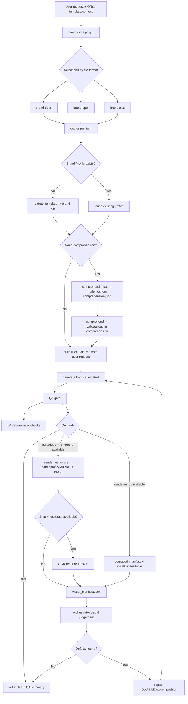
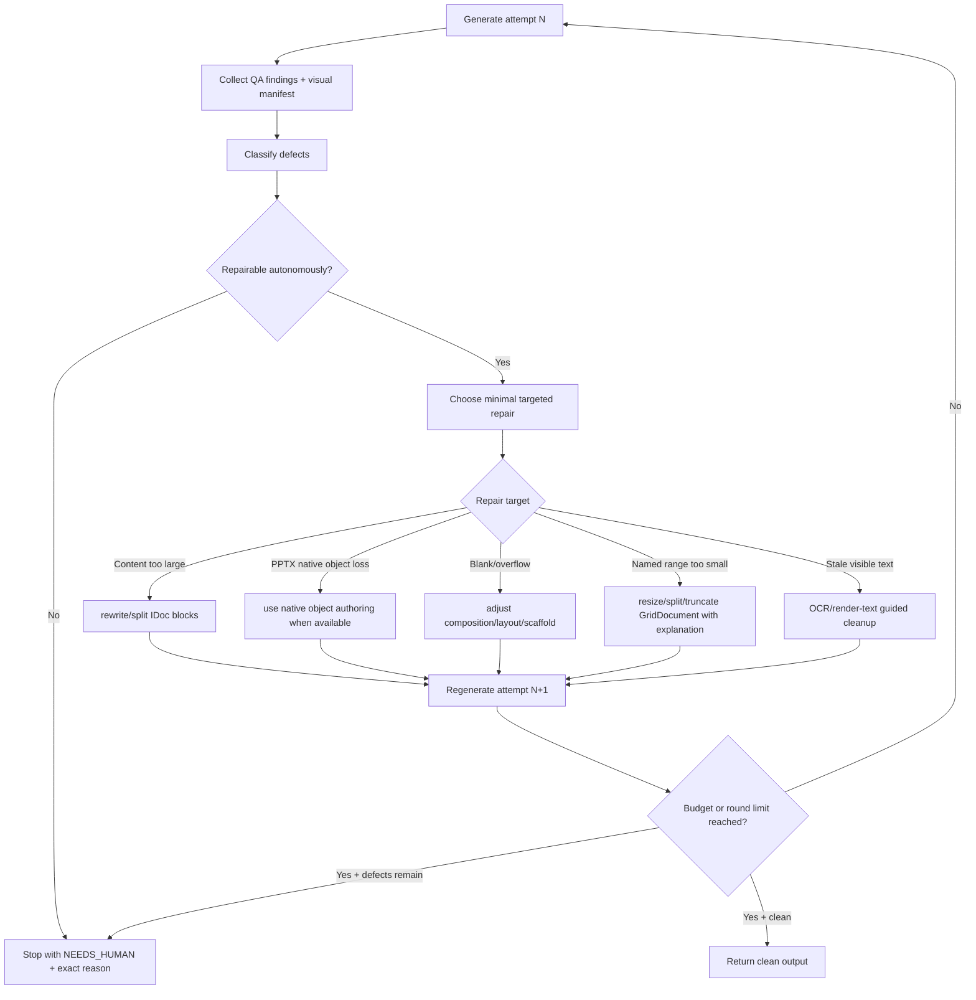

# BrandDocs Plugin Workflow

This document is the operational map for the BrandDocs plugin and its three
format skills (`brand-docx`, `brand-pptx`, `brand-xlsx`). It describes how an
agent should move from a user request to a generated Office file, how QA is
interpreted, and how autonomous repair rounds should be decided.

The goal is not merely to generate a file. The goal is to produce an on-brand
file, know which guarantees were proven, identify what remains uncertain, and
run as many targeted repair rounds as are justified.

## Plugin Surface

The plugin manifest is `.claude-plugin/plugin.json`. It loads three skills:

| Skill | Format | Primary output |
|---|---|---|
| `brand-docx` | Word `.docx` | branded reports, memos, letters |
| `brand-pptx` | PowerPoint `.pptx` | branded decks |
| `brand-xlsx` | Excel `.xlsx` | branded workbooks |

The slash commands in `commands/` are thin wrappers over the internal CLI:

| Command | CLI verb |
|---|---|
| `/brand-extract` | `python scripts/brandkit/cli.py extract ...` |
| `/brand-verify` | `python scripts/brandkit/cli.py verify ...` |
| `/brand-generate` | `python scripts/brandkit/cli.py generate ...` |
| `/brand-list` | `python scripts/brandkit/cli.py list ...` |

The agent-facing skills are the intended user experience. The CLI is the engine
used by those skills for deterministic work.

## Current End-to-End Flow



## Target Autonomous Repair Flow

The model using the skill should treat QA and visual output as a feedback loop,
not as a one-shot report. Each round should classify defects, decide whether they
are repairable, apply the smallest targeted change, regenerate, and re-audit.



## Round Artifacts

Every autonomous generation job should keep a trace directory. This gives the
next model call enough context to understand what happened and decide whether
another repair round is justified.

```text
generated/<job>/
|- attempt-1/
|  |- input.idoc.json            # or input.grid.json for xlsx
|  |- output.docx|pptx|xlsx
|  |- qa_findings.json
|  |- visual_manifest.json       # pages, L1, environment, optional OCR report
|  `- repair_decision.json
|- attempt-2/
|  `- ...
`- final_report.md
```

`repair_decision.json` should be small and explicit:

```json
{
  "attempt": 1,
  "verdict": "repair",
  "defects": [
    {
      "source": "qa.component_survival",
      "symptom": "native chart dropped from PPTX output",
      "likely_cause": "chart block down-rendered to text",
      "repair": "switch to native PPTX chart authoring when available, otherwise explain the unsupported component"
    }
  ],
  "next_action": "regenerate"
}
```

## Defect Classes and Preferred Repairs

| Defect class | Typical signal | Preferred repair |
|---|---|---|
| Missing dependency | `doctor` missing required Python package | install/repair before running core engine |
| Visual render unavailable | `visual.unavailable`, degraded manifest | proceed only with L0, or install renderers before claiming visual proof |
| Residual demo text | `no_residual_template_text`, `visual.ocr_residual_text`, OCR/render text | remove or replace captured demo region, then regenerate |
| Stale derived index | stale TOC/agenda/list entries | regenerate field cache/index from current headings |
| Blank pages/slides | `visual.blank_page`, large empty render | collapse/move/remove inherited scaffold or section break |
| Edge bleed/clipping | `visual.edge_bleed`, visual inspection | split content, reduce block density, adjust composition |
| Native object loss | `component_survival` warning | use native object authoring when available or explain unsupported component |
| XLSX range overflow | named range bounds error | split data, shrink input, or ask user to expand template range |
| Formula loss | formula preservation finding | stop and repair generator; never ship silently |

## Round Budget Policy

The agent should choose the number of repair rounds autonomously, bounded by
evidence and cost:

1. Run at least one repair round when a defect has a clear targeted fix.
2. Continue while each round removes a defect or produces more precise evidence.
3. Stop when the remaining issue needs user intent, a missing dependency, or a
   generator capability that does not exist yet.
4. Never claim a clean visual audit from a degraded manifest.
5. Report `NEEDS_HUMAN` with exact blockers when autonomous repair is exhausted.

## Clean Final State

A generated artifact is ready to return when:

- L0 deterministic QA has no errors.
- Any warnings are either resolved or explained as accepted limitations.
- If visual renderers are available, `--qa deep` has a manifest with pages and
  L2 checklist items judged clean. If OCR is available, `ocr.hits` is empty or
  each hit is explained and intentionally accepted.
- If visual renderers are unavailable, the final response clearly says visual
  proof is degraded and lists the `doctor` repair hint.
- The final file path and QA summary are returned to the user.
